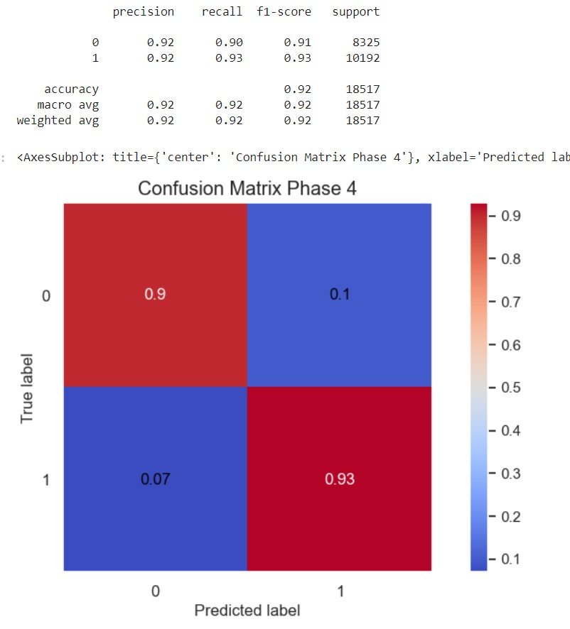

# CapstoneProject : Car Insurance Claim Prediction

Phase 2 : Deliverables

## Main points from data exploaration
View Python File: [Data Exploration Report](data_exploration.ipynb)  
- There are 58592 rows and 44 columns 
- The target column “Is_Claim” has 54844 zeros (0) and 3748 ones (1) 
- The data contains no null values
- Data types: 
	- float64(4)
	- int64(12)
	- object(28)

- Correlation:
	- the correlation between the target column “Is_Claim” and the other features is low. 
	- The columns with the highest correlations are policy_tenure, age_of_car, age_of_policyholder and population_density

Tableau Dashboard:  https://public.tableau.com/app/profile/akanksha.lamba/viz/Insurancedatastatistics/DASHBOAR

Dashboard includes the following visualizations:

- Summary table: 
	- Total claims count : 
		- Yes - 54,844
		- No -   3,748
	- Claims based on Transmission type of the vehicle
		- Manual - 38,181
		- Automatic - 20,411
	- Claims based on Model of vehicle
		- Maximum claims submitted for Model M6
		- M1 model that has the least claims 
	- Claims based on area cluster visualized using treemap
		- C8 area cluster has the most claims with 954 claims
- Claims based on age of the policyholder stacked bar chart will be utilized
	- Most claims were submitted by the policyholder within age group of 25-30 years
- Claims based on various vehicle classifiers using highlight table
	- Most claims were submitted by Petrol operated vehicles with K-Series Dual jet
- Safety rating of the vehicle visualized using horizontal bar chart
	- Most policy holders rated there vehicle as 2/5 in safety rating i.e 21,402
- Pie-charts visualizing claims based on the cylinder type
	- Most claims submitted by 4 cylinder car equivalent 2,443
	

## Machine learning model and results

In the second week of creating data model,we tried different approach and worked on Logistic Regression model,Decesion Tree Regressor and TransformedTargetRegressor models and compared their accuracy and precesion scores.
There were some steps involved before performing train and test on models which includes:
- Performed basic data cleaning(drop_columns,check nul values,unique values)
- Classification of continuous and categorical columns.
- LabelEncoder for binary columns(YES/NO -> 0/1).
- Grouping(using k-means clustering) columns which share same values or represent same catergorical meanings.
- One-hot-encoding for categorical columns.
- Perform various undersampling and oversampling techniques.
- Train and test each model with every sampling technique and record classification report and confusion matrix.

### Logistic Regression model

### Decesion Tree Regressor  

### TransformedTargetRegressor

### Confusion matrix and an Accuracy score

## Presentation 
Link: https://docs.google.com/presentation/d/1zEQEcLH0pdJx044-sZFgpIWhDq1492tVU-b_lRdr-uA/edit?usp=sharing

- Introduction: overview of the project, problem statement, objective
- Data collection and preprocessing
- Data exploration findings
- Methodology: overview of the machine learning
- Results and evaluation 
- Conclusion: Summary of findings, limitions, future work and recommendations

